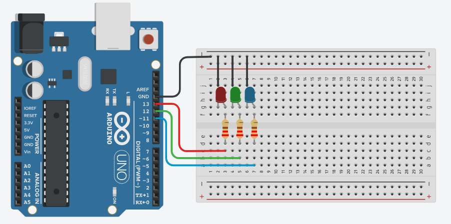

# Arduino_Led_v6
## Contextualizando
Neste experimento faz com que o LED incorporado e dois LEDs acendam e apaguem em
sequência utilizando o pino digital 13 (LED_BUILTIN ), o pino digital 12 e o pino digital 11.
## Esquema do projeto 

